# CalculadoraAndroid

Este repositorio contiene la aplicación android de una calculadora

<h2>1º El diseño de la calculadora🐱‍🏍✨</h2>

El diseño de la calculadora se divide en dos fases en la primera que es la actividad que se ejecuta  
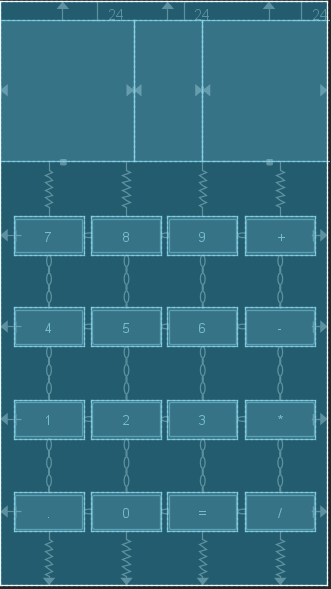  
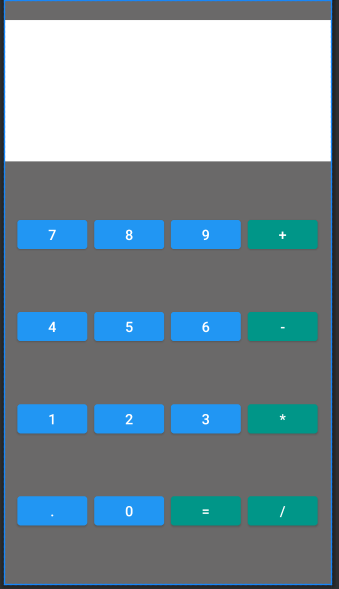  
Y la segunda parte que es la actividad que se ejecuta cuando se da al igual que muestra el resultado de la cuenta 
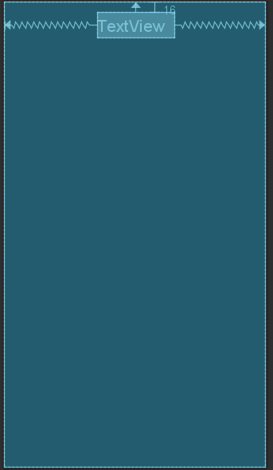  
  

<h2>2º El codigo de la calculadora🐱‍🏍✨</h2>

El codigo de la calculadora tambien se divide en dos fases:

 <h3>1ª Fase: 🥇🥈🥉</h3> 

 Es la actividad que se ejecuta en la cual hace falta crear diferentes propiedades de la clase MainActivity.java las cuales son dos StringBuffer donde se acomularan los numeros de los botones un string para el tipo de cuenta que se realizara, un int y un float este ultimo es para el resultado y el anterior para saber si a pulsado el +, -, / o * y tantos TextView como paneles tengas en este caso hay tres. 
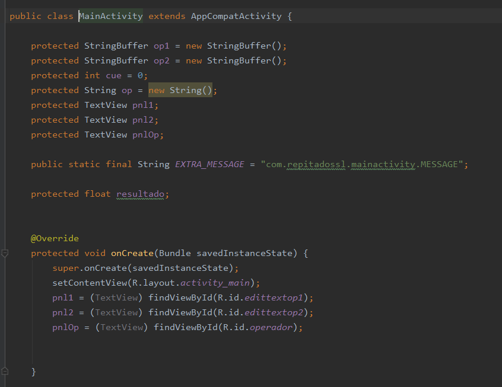  
 En el metodo onCreate a los paneles se busca por el id de los paneles que sale en el diseño a la derecha de la pantalla. 
 También hay que crear un metodo que mande el texto que contienen los StringBuffer a los paneles con un setText 
 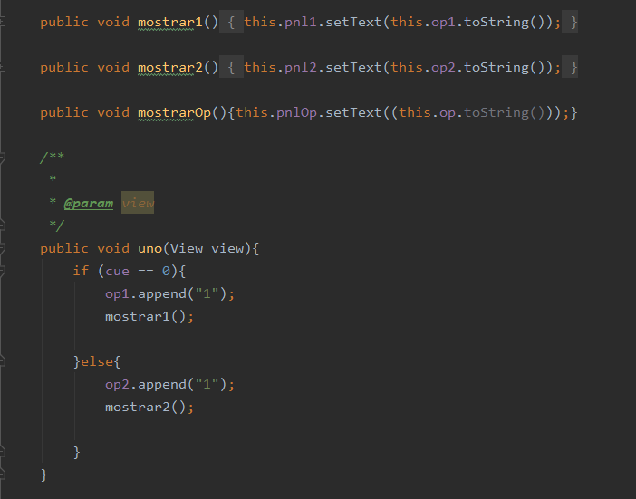  
 Hay que crear tantos metodos como numeros en la calculadora donde al StringBuffer se le añade el numero del pulson botado. 
 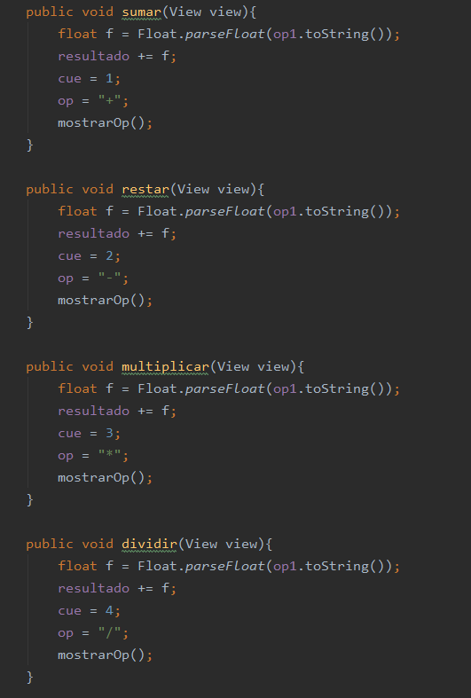  
 Cuando se pulsa el boton del signo para operar hay que cambiar de StringBuffer y al resultado que en ese momento era cero sumarle el contenido el StringBuffer pasado a float por si contiene el punto. 
 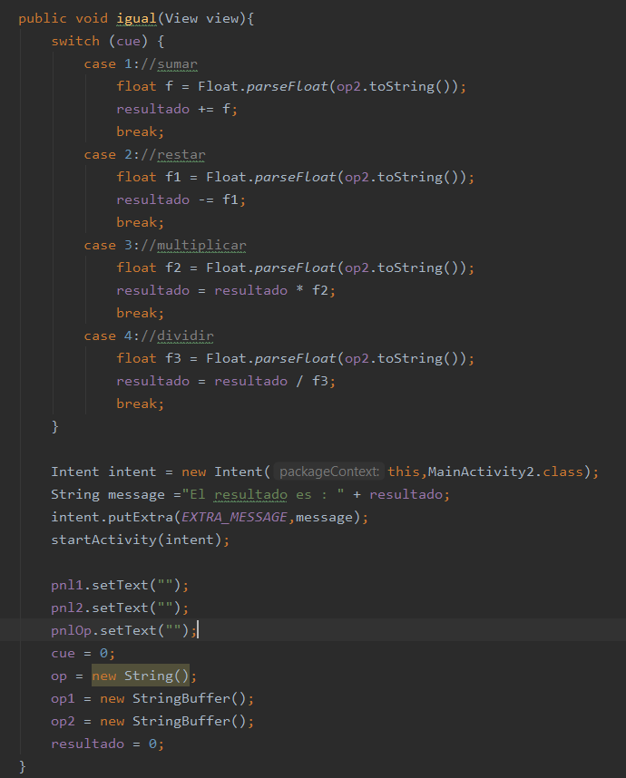  
 Por Ultimo se crea el metodo que se enlaza en el igual en el se utilaza un switch para saber si es una suma, resta, multiplicacion o division al final se crea un Intent que sirve para conectar dos actividades al que se le pasa el resultado, tambien se vacian los TextView y se incializan las propiedades para poder volveer a calcular. 
 Todos los metodos de los numeros igual y signos se tendran que enlazar con su crrespondiente boton en el xml 
 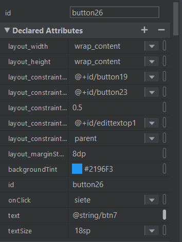  

<h3>2ª Fase: 🥇🥈🥉</h3>

Esta fase se centra en la actividad segundaria que se lanzara para cuando pulsemos el boton de igual 
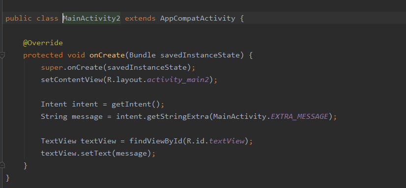  
En esta lo que se hace es poner en resultado en un TextView

<h2>Añadido🐱‍🏍✨<h2>

Lo siguiente no influye en el funcionamiento de la calculadora pero sirve para que se vea mejor.

<h3>Icono de la aplicación 🥇🥈🥉</h3>

El icono utilizado es el siguiente 
  
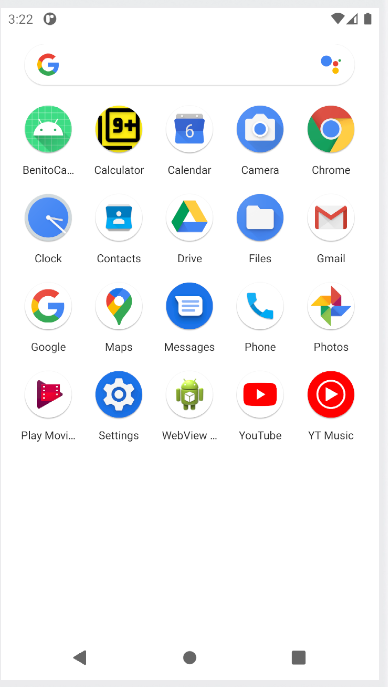  
En la bibliografia se encuentra el enlace al video tutorial.

<h3>Boton para volver a la calculadora🥇🥈🥉</h3>

El boton se consigue con el siguiente codigo. 
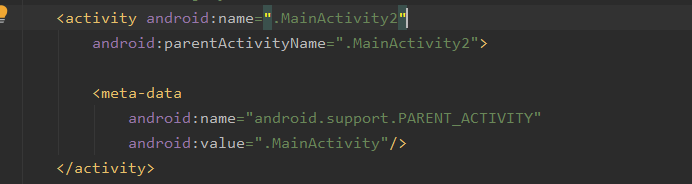  
y el resultado es el siguiente. 
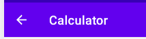  

<h2>Funcionamiento de la aplicación🐱‍🏍✨<h2>

  

<h2>Bibliografia🐱‍🏍✨<h2>
-Video para el icono 
https://www.youtube.com/watch?v=OACRVxwWYrM&ab_channel=Rackcode.info 
-Pagina para crear el icono 
https://romannurik.github.io/AndroidAssetStudio/icons-launcher.html#foreground.type=clipart&foreground.clipart=android&foreground.space.trim=1&foreground.space.pad=0.25&foreColor=rgba(96%2C%20125%2C%20139%2C%200)&backColor=rgb(68%2C%20138%2C%20255)&crop=0&backgroundShape=square&effects=none&name=ic_launcher

<h2>Autor🐱‍🏍✨<h2>
<h4>David Parejo Aliaga 1ºDAW</h4>
